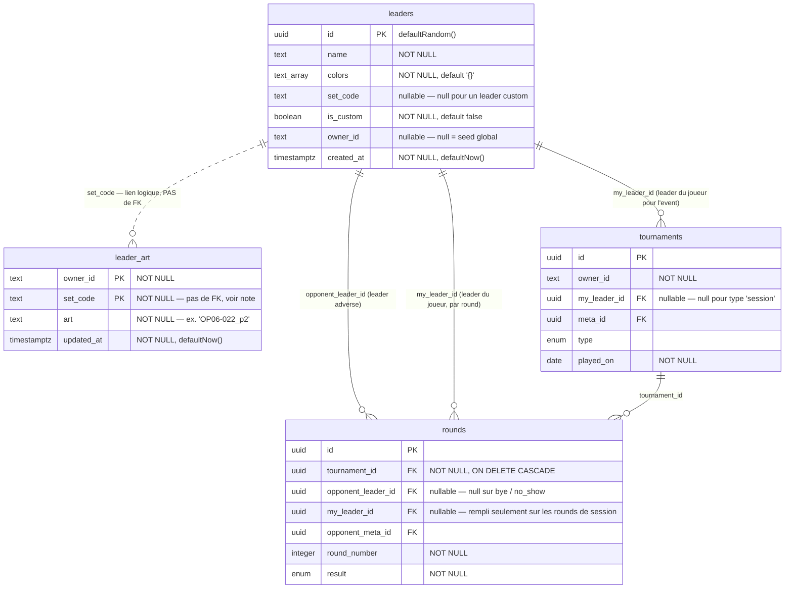

# Stockage des leaders

Périmètre : les deux tables qui portent les leaders (`leaders`, `leader_art`) et
les colonnes qui les référencent depuis `tournaments` / `rounds`.
Source : [src/db/schema.ts](../src/db/schema.ts).

## Notes

**`leaders`** — un seul catalogue pour les leaders officiels et les leaders custom.
`owner_id = null` ⇒ ligne de seed globale, visible par tout le monde ;
`owner_id` renseigné + `is_custom = true` ⇒ leader créé par ce joueur.
`set_code` est le code carte officiel (`OP06-022`) et reste null sur les customs.

**`leader_art`** — préférence purement cosmétique : quelle impression du leader
(base, Parallel, Alternate Art, SPR) le joueur veut voir. Clé primaire composite
`(owner_id, set_code)`.

- Volontairement **sans clé étrangère** vers `leaders.id` : les `id` sont réattribués
  à chaque reseed, les `set_code` non. Le lien se fait donc par `set_code`.
- **Absence de ligne = impression de base.** La table ne contient que les écarts
  réels au défaut.
- Les leaders custom (pas de `set_code`, pas d'art) n'y apparaissent jamais.
- `art` référence un `card_image_id` de `LEADER_ART[setCode]` dans
  [src/lib/leader-images.ts](../src/lib/leader-images.ts) — la liste des impressions
  disponibles vit dans le code, pas en base.
- Rien dans les statistiques ne lit cette table : un leader reste un leader quelle
  que soit son illustration.

**Où le leader est enregistré** — `tournaments.my_leader_id` pour un event à leader
unique ; pour les `session`, il est null et c'est `rounds.my_leader_id` qui porte le
leader, round par round.
