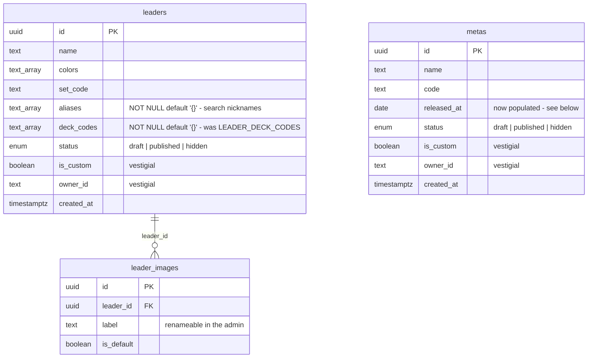

# Catalog admin: statuses, editing, and a proposing importer

Status: approved, ready to plan
Date: 2026-08-30
Follows: `2026-08-30-leader-images-in-db-design.md` (stage 1), which must ship first.

## Problem

Stage 1 moved leader art into the database, which removed the mechanism that
destroyed hand corrections. It did not give anyone a way to make one. The
catalog is still whatever `scripts/build-leader-data.ts` last pulled from
optcgapi: names, colors and set codes land in `src/db/seed-data.ts`, art lands in
`leader_images`, and nothing distinguishes an entry that was reviewed from one
that was merely fetched.

What is missing is curation. A new set should arrive as a proposal, not as fact;
a wrong image or a wrong name should be fixable in place; and an entry that
should not be offered to players should be removable from the pickers without
being erased from history.

## Scope

One spec, covering three things that only make sense together:

1. A `draft` / `published` / `hidden` lifecycle on `leaders` and `metas`.
2. An admin area for editing both, managing leader art, and publishing or
   hiding in bulk.
3. `build-leader-data.ts` rewritten as an importer that proposes drafts and
   never overwrites.

These were considered as two separate deliverables — the lifecycle plus admin,
then the importer. The owner chose a single spec. The tradeoff, recorded here on
purpose: the document is long and nothing is usable until all of it lands. The
old script keeps working untouched until item 3 replaces it, so the repository
is never in a broken state, only an unfinished one.

### Out of scope

- Reconciling a reported difference from inside the admin ("the API says X, you
  have Y — accept?"). The importer reports differences in its terminal output;
  correcting one is a normal edit in the panel. A diff-reconciliation UI is its
  own product.
- Ban lists, card legality, tournament-type configuration.
- Any change to how statistics are computed.

## Decisions taken

| Decision | Choice | Why |
|---|---|---|
| Statuses | `draft` / `published` / `hidden`, shared enum on both tables | `draft` is "never reviewed", `hidden` is "reviewed and set aside". Collapsing them loses the distinction that makes a review queue possible. |
| Existing rows | All `published` | The app keeps working exactly as it does today and the owner curates at their own pace. |
| Legacy custom rows | `draft` | Any row with a non-null `owner_id` surfaces for review. Nothing creates these today (see below), so this is a cleanup of history, not a policy. |
| Hidden leaders in history | Still shown, not offered | A hidden leader keeps appearing in past matches and statistics; it only leaves the pickers. |
| Admin access | Clerk `publicMetadata.role === 'admin'` | Extensible to a second maintainer without a redeploy, unlike an env var list. |
| Image upload | Resized and cropped in the browser | Keeps `sharp` out of production dependencies and sends ~30 KB over a venue connection instead of a multi-megabyte scan. |
| Crop | Chosen by the user, centred by default | An algorithm that frames each card differently is the exact defect the current pipeline produces. |
| Importer | Local script, insert-only | optcgapi asks callers not to hammer the API, and `sharp` stays a devDependency. |

**There is no user-facing catalog creation to remove.** The owner asked to end
user creation of custom leaders; investigation shows it never existed. There is
no `POST /api/leaders` and no `POST /api/metas` — `src/app/api/reference.route.test.ts`
asserts their absence. `is_custom` and `owner_id` are read by the visibility
filters but never written. The columns stay as they are; only legacy rows are
swept into `draft`.

## Data model

New: `catalog_status` enum (`draft`, `published`, `hidden`); `leaders.status`,
`metas.status`, `leaders.aliases`, `leaders.deck_codes`.

### The migration cannot use a plain default

`ADD COLUMN status ... NOT NULL DEFAULT 'draft'` would put all 308 existing
leaders into `draft` and empty the application. Three steps instead:

1. `ADD COLUMN status catalog_status NOT NULL DEFAULT 'published'`
2. `UPDATE ... SET status = 'draft' WHERE owner_id IS NOT NULL`
3. `ALTER COLUMN status SET DEFAULT 'draft'` — so everything inserted afterwards
   arrives as a proposal

`leaders.deck_codes` is backfilled from `LEADER_DECK_CODES`, which stage 1 parked
in `src/lib/leader-deck-codes.ts`. That module is deleted here and
`leaderSearchText` reads the column.

### Visibility: the rule that protects history

The owner's decision is that a hidden leader stays visible in past matches and
only leaves the pickers. The client fetches the leader list once and resolves
names by id, so an endpoint returning only published rows would render `—` where
an old match used a leader that has since been hidden.

**`/api/leaders` returns every published leader, plus every leader referenced by
this player's own tournaments or rounds, whatever its status.** One query, an
`EXISTS` against `rounds` and `tournaments`. The DTO carries `status`, and the
pickers filter on `published` client-side — "offerable" becomes a display filter
rather than a second request.

`/api/metas` follows the same rule against `tournaments.meta_id` and
`rounds.opponent_meta_id`.

This is the single most breakable thing in the spec, and it is what the first
test in the Testing section pins down.

### `metas.released_at` stops being dead

`src/lib/meta-selection.ts:8` records that `released_at` "is null for every row,
so it cannot be used here", and `pickDefaultMetaId` therefore picks the newest
meta by comparing codes lexically. Its own doc comment lists the fragility: an
`ST`-prefixed meta would outrank `OP16`, and `"OP99" > "OP100"`.

Filling the 16 dates through the admin removes that whole class of bug.
`pickDefaultMetaId` switches to "the most recently released official meta", and
the lexical-ordering tests are **replaced**, not kept alongside — a test for a
rule that no longer exists is a lie about the code.

Metas with no `released_at` are excluded from the default pick and fall back to
the lexical rule, so the app keeps working while the dates are being entered.

## Admin access

The role lives in the user's Clerk `publicMetadata` as `{ "role": "admin" }`,
surfaced in the session token so it can be read without an API call per request.

**This requires manual configuration in the Clerk dashboard** — see "What the
owner must do" at the end. Without it, nobody can get in. That is configuration,
not a bug.

Two barriers, deliberately redundant:

- `src/proxy.ts` gains matchers for `/admin(.*)` and `/api/admin(.*)` that check
  the role.
- Every admin route also calls a `requireAdmin()` helper placed beside the
  existing `requireUserId()` in `src/lib/api/handler.ts`.

The middleware alone would be enough while it is correctly written, and a
mis-written matcher opens the whole area with nothing to signal it. The in-route
check is what turns that mistake into a visible failure.

A non-admin hitting `/admin` gets **404** — the page is unlisted, so it may as
well not exist. `/api/admin/*` answers **403** in JSON, because a client that
gets a 404 from an API concludes the endpoint moved.

**Every admin route lives under `/api/admin/`**, so the matcher is one prefix
rather than a decision repeated per route.

`/settings` shows an "Administration" link when `user.publicMetadata.role` is
`admin`. That is display convenience, not security; the two server barriers are
what enforce anything.

## The admin area

`/admin` redirects to `/admin/leaders`. A tab switches to `/admin/metas`. Both
share one shell.

### The leaders grid

One card per leader: the artwork, the name, the set code, colour pips, a status
badge. **Drafts sort first** — pending work should not have to be searched for.

Filter bar: status, colour, free text (name, aliases, set code, deck codes), and
a "no image" filter. That last one exists because a missing image is the only
anomaly a grid of pictures cannot show you.

### Selection and bulk actions

A checkbox per card. "Select all" applies to the **current filter**, never the
whole catalog — selecting 308 invisible rows is a trap. With at least one card
selected, an action bar appears: *Publish*, *Hide*, *Back to draft*, and the
count.

Publishing a leader with no artwork is **not blocked**. The bar says "12
leaders, 3 without artwork" and lets the owner decide. A leader with no art
renders as a coloured initial, which is degraded but valid, and a guard here
would be wrong more often than useful.

### The edit panel

Clicking a card opens a side panel: name, colours, set code, aliases, deck
codes, status, and the image list. On images: set the default, rename a label
(`p1` → `Alternate Art`), delete a wrong image, upload a new one.

"New leader" opens the same panel empty. One form, one code path, one thing to
test.

### Upload, with the crop the owner chooses

The browser reads the file and shows it under a fixed 5:7 frame. The owner pans
and zooms; the frame starts centred. On confirm, a canvas draws the selected
region at 240px wide and encodes WebP. The server receives ~30 KB already in the
right format, hashes it, and inserts the row.

No cropping library: a CSS `transform` for the preview and a `drawImage` with
the matching source rectangle.

**The server does not trust any of that.** It caps the body at 512 KB, and
verifies the bytes actually begin with a WebP signature (`RIFF....WEBP`) rather
than believing the declared content type. A client can lie; the server check is
what keeps the table sound.

### The metas screen

The same, simpler: no images. A row per meta with name, code, release date and
status, the same action bar, and the same edit panel.

## The importer

`scripts/build-leader-data.ts` becomes `scripts/import-catalog.ts`, run with
`npm run db:import-catalog`. It queries optcgapi exactly as today (boosters,
structure decks, promos) and writes no files at all. It is **insert-only**:

- a set code with no leader → inserted as `draft`, with its printings
  downloaded, resized by `sharp` and inserted into `leader_images`;
- a set with no meta → inserted as a `draft` meta;
- a new printing of a leader that already exists → inserted into
  `leader_images`, leaving `is_default` alone;
- a leader that exists but whose name or colours differ from the API → **nothing
  is written**. The difference is listed in the closing report.

That last rule is the inversion of the original problem: the script proposes,
the owner disposes. No path exists by which it can overwrite a hand correction.

### What this costs

`src/db/seed-data.ts` is deleted, and `seedReferenceData()` loses its data
source. The function is used by the test suite, which needs a catalog, so it
becomes `seedReferenceData(db, data)` and the tests pass a five-leader fixture
instead of depending on a 163-line generated file.

Consequence: **a fresh database has no catalog until the importer runs.** That
is coherent — the importer becomes the only way catalog data enters — but it
changes first-run setup on a new machine, and `README.md` must say so.

`public/leaders/` is no longer written by anything, so the `.gitignore` entry
stage 1 added is removed with the script.

## Testing

Real Postgres, `resetDb`, no mocks, following the existing suites.

**Visibility — the one that can silently corrupt history.** `listLeaders`
returns published leaders; returns a `hidden` leader that this player's own
round references; does **not** return a `hidden` leader nobody played. Same
three cases for metas.

**Authorisation.** Each `/api/admin/*` route answers 403 without the role — one
test per route, not one generic test. A missing route is exactly the bug a
generic test cannot see.

**Upload.** A 30 KB WebP is accepted; a 2 MB body is rejected; a PNG with a
WebP content type is rejected on its signature.

**Bulk actions.** Publishing three selected leaders changes three rows and
leaves the rest alone.

**Importer**, against fixture API responses: a new leader is inserted as
`draft`; an existing leader whose name differs is **not** modified and appears
in the difference report; a new printing of an existing leader is inserted
without moving `is_default`.

**`pickDefaultMetaId`** selects by `released_at`, falls back to the lexical rule
when no meta has a date, and its old lexical-only tests are replaced.

**The grid and the crop are verified by hand in a browser.** Selecting, bulk
publishing, cropping an upload and confirming the stored image matches the frame
that was chosen. This is not automated here and is not claimed to be.

## Done when

- Statuses exist on both tables; existing rows are `published`; new rows default
  to `draft`.
- The admin publishes, hides, edits and uploads for leaders and metas.
- `npm run db:import-catalog` inserts drafts and modifies nothing existing.
- `src/db/seed-data.ts`, `src/lib/leader-deck-codes.ts` and
  `scripts/build-leader-data.ts` are gone.
- `npx tsc --noEmit`, `npm run lint` and `npm test` pass.

## What the owner must do by hand

1. **Clerk dashboard → Sessions → Customize session token**, set it to
   `{"metadata": "{{user.public_metadata}}"}`.
2. **Clerk dashboard → your user → Public metadata**, set `{"role": "admin"}`.
3. After deploying: run `npm run db:import-catalog` once, then review the drafts.
4. Enter the 16 meta release dates in `/admin/metas` so `pickDefaultMetaId`
   leaves its lexical fallback behind.

## Constraint

Per `AGENTS.md`: this is not the Next.js in your training data. Read the
relevant guide in `node_modules/next/dist/docs/` before writing route handler,
middleware or caching code.
