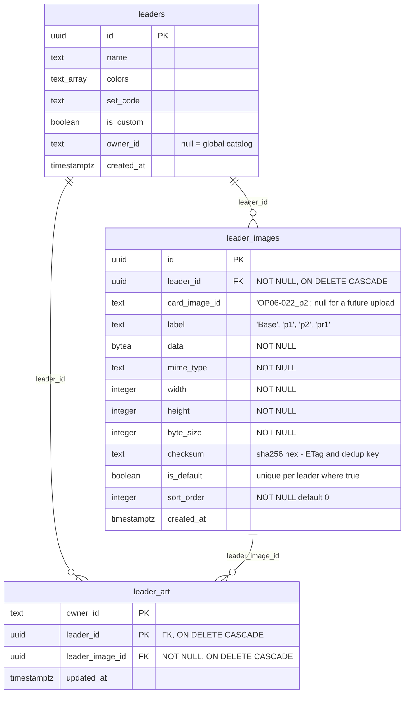

# Leader images in the database

Status: approved, ready to plan
Date: 2026-08-30

## Problem

The leader catalog and its art are generated files. `scripts/build-leader-data.ts`
pulls from optcgapi and writes `src/db/seed-data.ts`, `src/lib/leader-images.ts`
and 308 files in `public/leaders/`; `scripts/import-clean-art.ts` writes
`src/lib/clean-art.ts` and 120 files in `public/leaders/clean/`. Both files carry
a "do not edit by hand" banner, and they mean it — a correction made by hand is
lost on the next run.

That is the root problem. The art is wrong in places (the hand-collected source
folder holds `(2)`/`(3)` files that are *different characters*, not other
printings of the same card, so anything positional puts the wrong face on a
leader), the text catalog has gaps, and there is no durable way to fix either.

## Scope

This spec covers **stage 1 of two**: move leader art out of generated files and
into the database, with no visible change to the application.

Stage 2 — a `status` column (`draft`/`published`/`hidden`), an admin page for
editing leaders, uploading art, picking the default printing and bulk
publish/hide, and `build-leader-data.ts` rewritten to import drafts instead of
overwriting files — is a separate spec, written after this one ships.

Stage 1 is deliberately invisible. It is worth doing on its own because it
removes the cause (generated files that get overwritten) and gives stage 2 a
sound model to build on, rather than building the feature and its foundation at
the same time.

### Out of scope

- Any admin UI, any upload path, any new status column.
- Changing leader names, colors or set codes. The text catalog keeps coming from
  `src/db/seed-data.ts` in stage 1.
- Image resizing at runtime. `sharp` stays a devDependency, used only by scripts.

## Decisions taken

| Decision | Choice | Why |
|---|---|---|
| Image storage | Postgres `bytea` | ~308 thumbnails at 240px ≈ 10-15 MB. No new service, images travel with the DB backup. Serving cost is neutralised by immutable HTTP caching (below). |
| Default printing | `is_default` boolean + partial unique index | A `leaders.default_image_id` FK would create a `leaders ↔ leader_images` cycle. `UNIQUE (leader_id) WHERE is_default` lets Postgres enforce "exactly one default" directly. |
| Image rows | Immutable | Fixing art inserts a new row and moves `is_default`; it never mutates bytes. This is what makes an id a permanent handle on exact bytes, and therefore what makes `immutable` caching honest. |
| `leader_art` | Kept, rewired onto real FKs | The current no-FK design is justified in the schema by "row ids are reassigned by a reseed". That stops being true once the DB is the source of truth. |
| `scripts/reset-reference-data.ts` | Deleted | It does `DELETE FROM leaders WHERE owner_id IS NULL`, which would now cascade the whole image catalog. Its one-off purpose (clearing the 25 invented seed leaders) was served long ago. |

## Data model



Constraints beyond the columns:

- `UNIQUE (leader_id, card_image_id)` — makes the backfill idempotent and stops
  the same printing being imported twice.
- `UNIQUE (leader_id) WHERE is_default` — one default per leader, enforced by
  Postgres rather than by application code.
- `leader_art` primary key becomes `(owner_id, leader_id)`.

Deleting an image cascades to the preferences that pointed at it, so a player
whose chosen printing is removed falls back to the leader's default instead of
pointing at nothing. This is a designed consequence, and it is tested.

## Image serving

`GET /api/leader-images/[id]` returns `data` with:

- `Content-Type: <mime_type>`
- `ETag: "<checksum>"`, answering `If-None-Match` with 304
- `Cache-Control: public, max-age=31536000, immutable`
- 404 for an unknown id

`immutable` follows from immutable rows: an id designates bytes that will never
change, because a correction produces a new id. The CDN therefore reads each
image from Postgres once per region and never revalidates, and no cache purge is
ever needed. Node runtime (`export const runtime = 'nodejs'`), matching the
other routes.

## What the client sees

The leader DTO grows its printings and loses nothing:

```ts
{ id, name, colors, setCode, defaultImageId, images: [{ id, label }] }
```

The URL is not transported — it is derived from the id as
`/api/leader-images/${id}`.

`getLeaderImage` stops composing a file path and becomes a three-step
resolution against the DTO: the player's chosen image → the leader's default →
`null`, which triggers the existing colored-initial fallback. Its callers
(`leader-avatar`, `leader-picker`, `result-card`, `headline-card`) keep the same
call shape.

`leader-art-provider` keeps its optimistic updates; it indexes `leaderId →
imageId` instead of `setCode → art`. `services/leader-art.ts` validates the
chosen image by checking the row belongs to that leader — a DB lookup replacing
the `printingsOf` membership check — and still deletes the row when the choice
equals the default, so the table holds only genuine deviations.

## Migration

Expand → backfill → contract, because production already holds real matches.

**1. Drizzle migration A.** Create `leader_images`. Add `leader_id` and
`leader_image_id` to `leader_art` as nullable. Drop nothing. Deployable while
the current app runs.

**2. `scripts/migrate-leader-images.ts`** — idempotent, re-runnable, keyed on
`(leader_id, card_image_id)`:

- For each global leader (`owner_id IS NULL`) with a `set_code`, take
  `printingsOf(setCode)` — which merges `LEADER_ART` (optcgapi) with `EXTRA_ART`
  (hand-collected printings optcgapi does not list).
- Read each printing's bytes from `public/leaders/clean/<printing>.webp` when
  `CLEAN_ART` has it, otherwise `public/leaders/<printing>.webp`. The clean
  choice is **per printing**, exactly as `getLeaderImage` decides today.
- Insert one row per printing: bytes, `image/webp`, dimensions from `sharp`,
  `byte_size`, sha256 `checksum`, `sort_order` following the printing order.
- `is_default` goes to `printings[0]` — the base printing, always. Clean art
  does not change *which* printing is the default, only where its bytes come
  from. This preserves today's rendering exactly.
- Backfill `leader_art`: match `set_code` to the leader and `art` to
  `card_image_id`. A row that finds no match is deleted — the preference is
  purely cosmetic and the player falls back to the default.

**3. Drizzle migration B.** Set the new `leader_art` columns `NOT NULL`, add the
foreign keys and the two unique indexes, drop `leader_art.set_code` and
`leader_art.art`.

Run the backfill against local first, verify the assertions below, then against
production between migration A and migration B.

## Deletions and one relocation

Removed once the backfill is verified:

- `src/lib/leader-images.ts`, `src/lib/clean-art.ts`, `src/lib/printings.ts`
- `public/leaders/` (308 files) and `public/leaders/clean/` (120 files)
- `scripts/reset-reference-data.ts` and its `db:reset-reference` npm script
- `scripts/import-clean-art.ts` — its output now lives in the DB, and stage 2's
  admin upload replaces it

`scripts/build-leader-data.ts` **stays as it is** in stage 1. It still writes
`seed-data.ts`, and it still writes `public/leaders/`, which is now unused — a
harmless dead output that stage 2 removes when the script becomes a DB importer.
Do not half-rewrite it here.

One relocation: `LEADER_DECK_CODES` lives in `leader-images.ts` but is not image
data — it is search metadata for `leaderSearchText` (five entries, mapping a
booster leader to the starter decks that reprint it). Move it verbatim to
`src/lib/leader-deck-codes.ts`. Stage 2 folds it into a column on `leaders`.

## Testing

The project tests against a real Postgres (`tests/setup/db`, `resetDb`,
`fileParallelism: false`). Stay in that mould; do not introduce mocks.

**Schema** — the invariants everything else rests on:
- two `is_default` rows for one leader fail;
- deleting a leader deletes its images;
- deleting an image deletes the `leader_art` rows that chose it.

**Route** — 200 with the right `Content-Type`, `ETag` equal to the checksum and
an `immutable` `Cache-Control`; 304 on a matching `If-None-Match`; 404 on an
unknown id.

**Backfill** — pure functions (filename → label, clean-vs-generated folder
choice) on fixtures, following `tests/build-leader-data.test.ts`. Plus
end-to-end assertions after a real run: one row per printing across all global
leaders, and exactly one default per leader that has a set code.

**Components** — `leader-avatar` and `leader-picker` resolve to
`/api/leader-images/<id>`, and fall back to the colored initial when a leader
has no image at all.

**Visual non-regression is manual, and not claimed as tested.** The criterion is
that the app looks identical. Check in the browser: leader list, picker, dark
mode, and the `html-to-image` share card — that canvas path is the most at risk
and must be verified explicitly, not assumed. Use the existing `npm run shot`
for before/after captures.

## Done when

- The app behaves and looks exactly as before.
- `src/lib/leader-images.ts`, `src/lib/clean-art.ts`, `src/lib/printings.ts`,
  `public/leaders/`, `scripts/reset-reference-data.ts` and
  `scripts/import-clean-art.ts` are gone from the repo.
- `npm test` and `npm run lint` pass.

## Constraint

Per `AGENTS.md`: this is not the Next.js in your training data. Read the
relevant guide in `node_modules/next/dist/docs/` before writing route handler or
caching code, and heed deprecation notices.
